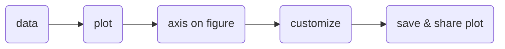

## Introduction 
- Matplotlib is [[Python]]'s plotting library built on [[NumPy]] that can integrate directly with [[Pandas]]
- Workflow:

> [!tip]
>Figure and plot are used interchangably
## Importing and getting started 
```python
%matplotlib inline # makes the notebook directly render the graphs 
import matplotlib.pyplot as plt
```
- `plt.plot;` creates a blank plot or figure (the ; gets rid of the array)
	- if the `;` is annoying, you can just type `plt.show()` after `plt.plot` to get the same effect 
### Pyplot vs object-oriented 
- According to the documentation, we should always use object-oriented when possible
### Methods of getting started 
```python 
# Method 1 
fig = plt.figure()
ax = fig.add_subplot()
plt.show()

# Method 2
fig = plt.figure()
ax = fig.add_axes([1,1,1,1])
ax.plot(x,y)
plt.show()

# Method 3 (recommended)
fig, ax = plt.subplots()
ax.plot(x,y)
```
## Anatomy of a plot 
![[matplotlib-anatomy-of-a-plot.png]]
![[matplotlib-anatomy-of-a-plot-with-code.png]]
## Example workflow 
```python
# 0. Import matplotlib and get it ready for plotting in Jupyter 
%matplotlib inline 
import matplotlib.pyplot as plt

# 1. Prepare data 
x = [1, 2, 3, 4]
y = [11, 22, 33, 44]

# 2. Setup plot 
fig, ax = plt.subplots(figsize=(5,10)) # (width, height)

# 3. Plot data 
ax.plot(x, y)

# 4. Customize plot 
ax.set(title="Simple Plot", 
	  xlabel="x-axis",
	  ylabel="y-axis")

# 5. Save your image 
fig.savefig("path/filename.png")
```
## Different types of plots  
- `ax.scatter(data)`: creates a scatterplot 
- `ax.bar(data, data)`: creates a bar plot 
- `ax.barh(list(data), list(data))`: creates a horizontal bar plot 
- `ax.hist(data)`: creates a histogram
## Combining plots
```python 
# Option 1 
fig, ((ax1, ax2), (ax3, ax4)) = plt.subplots(nrows=2
											ncols=2
											figsize=(10,5))
ax1.plot(data)
ax2.scatter(data)
a3.bar(data)
a4.hist(data)

# Option 2 
fig, ax = plt.subplots(nrows=2
					  ncols=2
					  figsize=(10,5))
ax[0,0].plot(data)
ax[0,1].scatter(data)
ax[1,0].bar(data)
ax[1,1].hist(data)
```
## Plotting from pandas DataFrames 
`car_sales.plot(x="column name", y="column name")`: this is the [[Pandas]] version of matplotlib 
