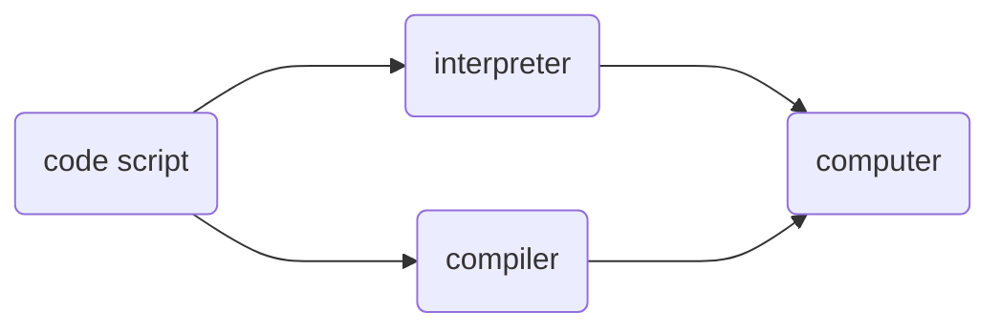

> [!Tip] About this note  
> The notes are from Zero to Mastery's complete Python course. I didn't take the whole thing as I already know Python, but it was a good refresher! Hence, the notes below are only to refresh my personal memory and not as comprehensive as other notes. 
### Introduction
#### What is a programming language? 

- ==Interpreter==: Goes line by line and executes the code (python usually uses this)
- ==Compiler==: Takes the entire file and turns it into executable machine code called binary
##### Python interpreter 
- When most people talk about Python, they're talking about `cpython` that translate your code script into machine executable code -- ie: `cpython` is a interpreter
### Fundamental Data Types 
- `int`: integer
- `float`: decimal numbers 
- `complex`: complex numbers (barely used)
- `str`: strings (ordered sequence of characters)
- `bool`: true (1) or false (0)
- `list`: ordered sequence of objects (like `arrays` in other languages)
- `None`: absence of values (like `NULL` in other languages)
- `dict`: unordered key value pair
- `tuple`: immutable lists 
- `set`: unordered collection of unique objects 
#### Math function examples 
- `**`: power of 
- `//`: integer division 
- `%`: modulo (remainder)
- `round(number)`: rounds the number up or down 
- `abs(number)`: absolute value of the number 
#### Operator precedence 
- `()`
- `**`
- `*` and `/`
- `+` and `-`
#### Type conversion 
- `int('string')` 
- `str(int)`
#### Escape sequence 
- `\` allows you to use special characters without breaking format 
- `\n` line break 
#### Formatted strings 
`print(f'hi {name}! you are {age} years old.')`
#### String indexing 
`[start:stop:stepover]`
- Start: where you want the string to start (default is 0)
- Stop: where you want to stop (default is the end)
- Step-over: the size of the step (default is 1)
> Negative index means that you start from the end 
#### Immutability 
- Strings are immutable 
- Lists are mutable 
#### Built in functions and methods 
- `len()`
- `.upper()`
- Methods vs functions 
	- Method: owned by something `.method()`
#### List slicing 
- Slicing a list creates a new list 
- `new = original` will just point to the original 
- `new = original[:]` will copy the original list 
#### Matrix 
- Basically nested lists 
#### List methods 
- `list.append(object)` adds object to the end 
- `list.insert(index, object)` adds the object at the specified index 
- `list.extend(list)` extends the list by adding the list 
- `list.pop(index)` removes the object at index (default is at the end) and returns the object you removed 
- `list.remove(object)` removes the first instance of the object and doesn't return anything 
- `list.clear()` clears the list completely 
- `list.index(object, start, end)` returns the index of the object if it is within the range that's specified (default range is the entire list if no start and end is specified)
	- `i in 'hi my name is meg` will return True because `in` is a special word 
- `list.count(object)` count how many instances of object is in the list 
- `list.sort()` sorts in place 'alphabetically' 
- `sorted(list)` sorts the list and returns a new list 
- `list.reverse` reverses the list in place (note that it doesn't sort it)
#### List tricks 
```python
list = [1, 2, 3, 4, 5]

# Both reverse the list BUT
list.revers() #reverses in place 
list[::-1] #reverses and returns a new list 

# copying a list 
list.copy()
list[:]

# creating a list from a range 
list2 = list(range(2, 8)) # [2, 3, 4, 5, 6, 7]

# creating a string from list 
separator = ' '
sentence = separator.join(['hi', 'I', 'am', 'Meg'])
print(sentence) #hi I am Meg
# short hand version
new_sentence = ' '.join(['hi', 'I', 'am', 'Meg'])
```
#### List unpacking 
```python
a,b,c,*other,d= [1,2,3,4,5,6,7,8,9]

print(a) # 1
print(other) # [4,5,6,7,8]
print(d) # 9
```
#### Dictionary 
```python
dictionary = {
	"a": 1,
	"b": 2
}
```
#### Dictionary keys 
- Dictionary key **has** to be immutable and unique 
	- Usually a string 
	- If there's a repeat, you're replacing the old key with the new one 
- `dictionary.get(key)` checks if the key even exists and if it exists then it returns its value 
```python
user = {
	'basket': [1,2,3],
	'greet': 'hello',
	'age': 20
}

print('greet' in user) #True
print('basket' in user.keys()) #True
print('hello' in user.values()) #True
print(user.items()) 
```
#### Sets 
- Basically can do the mathematical operations 
	- `set1.difference(set2)` tells you the difference between set1 and set2 are 
	- `set1.discard(value)` discards the value from set1 
	- `set1.difference_update(set2)` removes the difference from set1 
	- `set1.intersection(set2)` what's the intersection 
	- `set1.isdisjoint(set2)` checks if sets are disjoint
	- `set1.issubset(set2)` checks if set1 is a subset of set2
	- `set1.issuperset(set2)` checks superset (superset is the opposite of subset)
	- `set1.union(set2)` combines the two sets
### Vocabulary 
- ==Variables==: store data in different variables 
	- Rules: 
		- snake_case 
		- start with lowercase or underscore 
		- letters, numbers, underscores 
		- case sensitive 
		- can't overwrite key words 
	- Constants are usually written in all caps 
	- `__` variables should be left alone 
- Expression: Piece of code that produces a value 
- Statement: Entire line of code that performs some kind of action 
- Augmented assignment operator: instead of writing out `x = x + 2` you can write in short hand as `x += 2`
### Conditional logic 
```python
if condition: 
	expression
else:
	expression 
```
### Truthy vs Falsey 
- Python evaluates everything to be booleans when comparing them so even though strings aren't booleans, it is converted to be booleans behind the scenes 
	- Falsey would be `0` or `''`
	- Truthy would be like `'hello'`
### Ternary operator 
- AKA Conditional expression 
- Shorthand: `condition_if_true if condition else condition_if_false`
### Short circuiting 
- when using `or` it only evaluates the first condition if it's true 
### Loops 
```python
for i in [1,2,3,4,5]:
```
## Random Notes 
---
- Tuple vs Lists
	- Tuples are immutable while lists are mutable 
```python
long_string = '''
	WOW 
	0 0
	___
'''
```
## Exercises 
--- 
### Age guessing game 
```python
# Age guessing game 
birth_year = input('What year were you born?')
age = 2024 - int(birth_year)
print(f'You are {age} years old')
```
- Note: `input()` is always a string 
### Password checker 
```python
# Password checker
username = input('Enter your username: ')
password = input('Enter your password: ')
password_len = len(password)

print(f'{username}, your password {'*' * password_len} is {password_len} letters long')
```
### Logical operators 
```python
is_magician = False
is_expert = True

if is_magician and is_expert:
	print("you are a master magician!")
elif is_magician and is_expert == False:
	print("at least you're getting there!")
elif is_magician == False:
	print("you need magic powers!")
```
### is vs ==
```python 
print(True == 1) #True 
print('' == 1) #False 
print([] == 1) #False 
print(10 == 10.0) #True 
print([] == []) #True 

print(True is 1) #False 
print('' is 1) #False 
print([] is 1) #False 
print(10 is 10.0) #False 
print([] is []) #False 
```
- `is` checks the location of the item whereas equality checks just the values 
### Counter 
```python
my_list = [1,2,3,4,5,6,7,8,9,10]
sum = 0
for i in my_list:
	sum += i
print(sum)
```